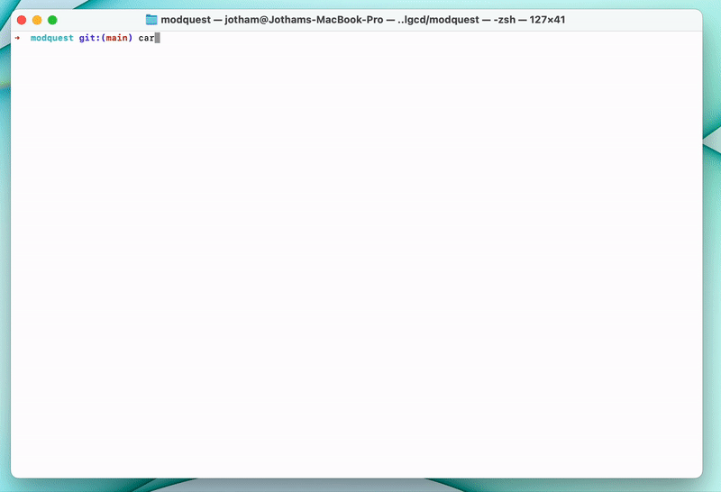

# 🧙‍♂️ Gandalf Challange Solutions

## 1. Product and Strategy


## 2. Computer Science
##### a) _Write a code that calculates the Modular multiplicative inverse of a number using the Euclidean Algorithm_

- [ Modular multiplicative inverse ( Rust ) solution ](https://github.com/CreamyMilk/gandalfz-challange/blob/main/src/main.rs)



## 3. Maths

##### a) _Find all non negative integers a, b such that sqrt(a) + sqrt(b) = sqrt(2009)_

- [Notion Doc](https://kinyua.notion.site/Maths-question-3a-4fb4aa7065724d529c7792c5bf3e7ffc) 
- [Github](https://github.com/CreamyMilk/gandalfz-challange/blob/main/math_3a.md) 


##### b) _Compute the SHA256 of 2009. Perform a transaction on the Görli testnet network and put this computed SHA in the data section of your transaction_

```sh
export PK = "<< Insert you'r private key here 👀 >> "
export GORLI_RPC = << You can get a Görli rpc_url from Alchemy or here 👀 : https://sourcegraph.com/search?q=context:global+https://eth-goerli.g.alchemy.com&patternType=standard >>
```

```sh
cast send                 \
    --private-key $PK     \
    --rpc-url $GORLI_RPC  \
    --value 0.00001ether 0x000000e2CF0D6a036022a78D694aF77456b32394 \
    $(echo 2009 | shasum -a 256  | cast --from-utf8)
```
